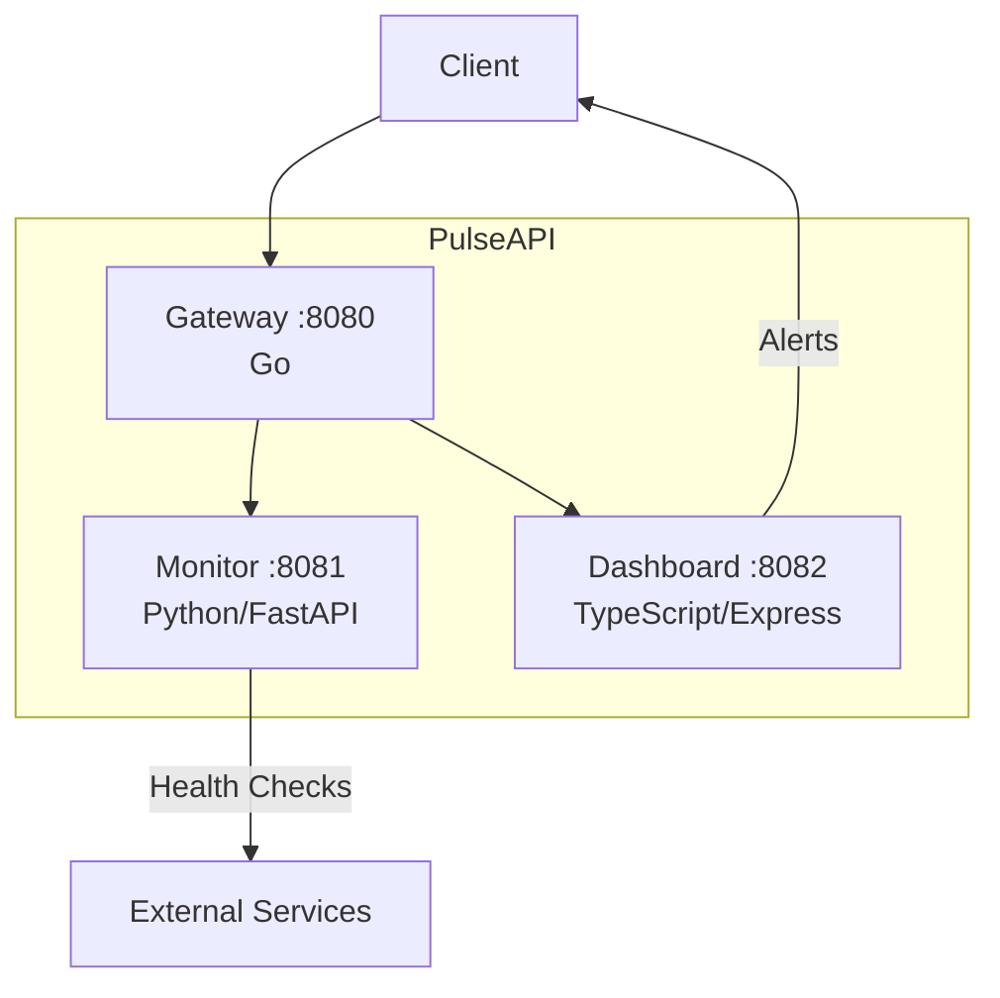

# PulseAPI

Real-time service health monitoring platform built with a microservices architecture. PulseAPI provides a unified gateway to monitor service health, manage monitoring targets, and handle alerts through three specialized services.

## Architecture



### Services

| Service | Language | Port | Description |
|---------|----------|------|-------------|
| **Gateway** | Go | 8080 | API gateway, request routing, aggregated status |
| **Monitor** | Python (FastAPI) | 8081 | Health check execution, target management |
| **Dashboard** | TypeScript (Express) | 8082 | Alert management, summary reporting |

## Quick Start

### Prerequisites

- Docker & Docker Compose
- (For local development) Go 1.21+, Python 3.12+, Node.js 20+

### Run with Docker Compose

```bash
# Start all services
make up

# Check status
make status

# View logs
make logs

# Stop all services
make down
```

### Environment Variables

Copy `.env.example` to `.env` and adjust as needed:

```bash
cp .env.example .env
```

See `.env.example` for all available configuration options.

## API Reference

### Gateway (port 8080)

| Method | Endpoint | Description |
|--------|----------|-------------|
| GET | `/health` | Gateway health check |
| GET | `/api/monitor/health` | Proxied monitor health |
| GET | `/api/dashboard/health` | Proxied dashboard health |
| GET | `/api/status` | Aggregated status of all services |

### Monitor (port 8081)

| Method | Endpoint | Description |
|--------|----------|-------------|
| GET | `/health` | Monitor health check |
| GET | `/targets` | List all monitoring targets |
| POST | `/targets` | Add a monitoring target |
| DELETE | `/targets/{name}` | Remove a monitoring target |
| POST | `/targets/{name}/check` | Trigger a health check for a target |

**Add Target Request:**
```json
{
  "name": "my-service",
  "url": "http://example.com",
  "interval": 30
}
```

### Dashboard (port 8082)

| Method | Endpoint | Description |
|--------|----------|-------------|
| GET | `/health` | Dashboard health check |
| GET | `/alerts` | List all alerts |
| POST | `/alerts` | Create a new alert |
| PATCH | `/alerts/{id}/acknowledge` | Acknowledge an alert |
| DELETE | `/alerts/{id}` | Delete an alert |
| GET | `/summary` | Alert summary statistics |

**Create Alert Request:**
```json
{
  "target": "web-app",
  "message": "High latency detected",
  "severity": "warning"
}
```

## Usage Example

```bash
# Add a monitoring target
curl -X POST http://localhost:8081/targets \
  -H "Content-Type: application/json" \
  -d '{"name": "my-api", "url": "http://example.com", "interval": 30}'

# Check target health
curl -X POST http://localhost:8081/targets/my-api/check

# Create an alert
curl -X POST http://localhost:8082/alerts \
  -H "Content-Type: application/json" \
  -d '{"target": "my-api", "message": "Service down", "severity": "critical"}'

# Get aggregated status
curl http://localhost:8080/api/status

# Get alert summary
curl http://localhost:8082/summary
```

## Development

### Run Tests

```bash
# All tests
make test

# Individual services
make test-go
make test-python
make test-ts
```

### Linting

```bash
# All linters
make lint

# Individual services
make lint-go
make lint-python
make lint-ts
```

## CI/CD

GitHub Actions workflow runs on push to `main` and on pull requests:

1. **test-go** — Go vet + tests
2. **test-python** — flake8 lint + pytest
3. **test-typescript** — ESLint + Jest
4. **docker-build** — Builds all Docker images (after tests pass)

> **Note:** The `.github/workflows/ci.yml` file may need to be manually added after initial repository setup due to GitHub API restrictions on the `.github/` directory.

### CI Workflow Content

The CI workflow file is located at `.github/workflows/ci.yml` in this repository. If it needs to be manually added, its content is included in the source tree.

## License

MIT
